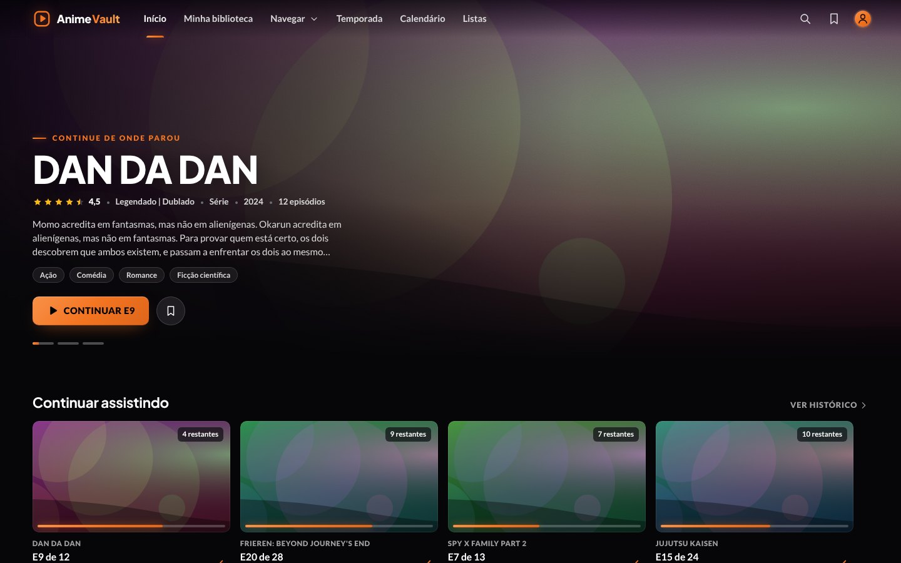
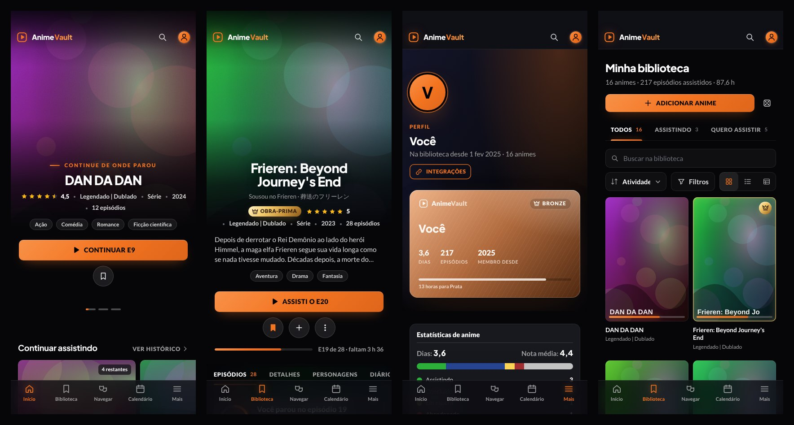
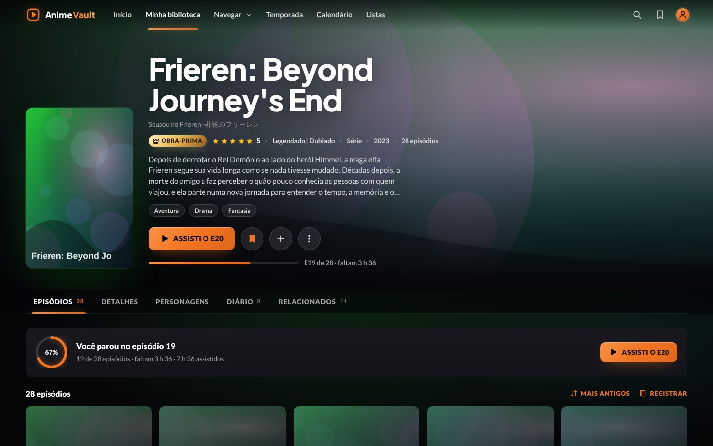
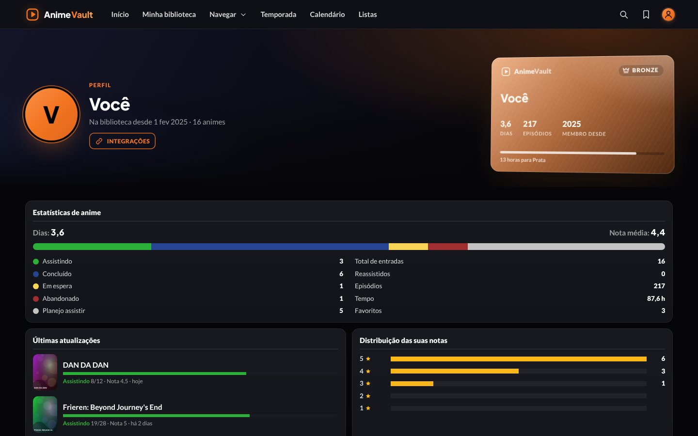

<p align="center">
  
</p>

<h1 align="center">Anime Vault</h1>

<p align="center">
  
  
  
  
  
</p>

<p align="center">
  <b>Sua biblioteca de animes no Obsidian, com acabamento de app de streaming premium.</b><br>
  Mesma base do Steam Vault 3.19.0, inspirado na Crunchyroll (palco preto, laranja, fileiras, episódios em miniatura)<br>
  e no MyAnimeList (notas de 1 a 10, lista em tabela, ficha com Informações e Estatísticas, perfil, Top anime).<br>
  <sub>Episódios, diário, temporadas, calendário de lançamentos, listas, estatísticas e sync público do AniList, em notas Markdown que continuam suas.</sub>
</p>

<p align="center">
  <a href="#-destaques">Destaques</a> ·
  <a href="#-instalação">Instalação</a> ·
  <a href="#-como-o-vault-é-organizado">Organização</a> ·
  <a href="DOCUMENTACAO.md">Documentação</a>
</p>

## ✨ Destaques

<table>
  <tr>
    <td width="33%" valign="top">▶️ <b>Ficha de cada anime</b><br><sub>Banner, capa, grade de episódios em miniatura, "Assisti o E5" com um toque, desfazer, detalhes, análise e relacionados.</sub></td>
    <td width="33%" valign="top">🏠 <b>Início estilo streaming</b><br><sub>Carrossel de destaques, Continuar assistindo, Novos episódios, Temporada atual, Quero assistir, sua semana e mais.</sub></td>
    <td width="33%" valign="top">📚 <b>Minha biblioteca</b><br><sub>Abas por status, busca, filtros (gênero, formato, estúdio), ordem, grade ou lista. Hover com sinopse, como na Crunchyroll.</sub></td>
  </tr>
  <tr>
    <td valign="top">📅 <b>Calendário de lançamentos</b><br><sub>Os próximos episódios da semana (AniList ou o dia que você informar na nota).</sub></td>
    <td valign="top">🍂 <b>Temporadas</b><br><sub>Como a página Simulcast: escolha a temporada, veja o que você tem e o que está em alta no AniList.</sub></td>
    <td valign="top">🗂️ <b>Gêneros, estúdios e franquias</b><br><sub>Cada um com página própria, cor e ícone. Franquias com a ordem para assistir.</sub></td>
  </tr>
  <tr>
    <td valign="top">📓 <b>Diário e histórico</b><br><sub>Cada episódio marcado entra com a data. Mapa de atividade, sequência de dias e maratonas.</sub></td>
    <td valign="top">📊 <b>Estatísticas e Tier List</b><br><sub>Por período: episódios, tempo, gêneros, estúdios, notas, dia da semana. Tier List com arrastar e soltar.</sub></td>
    <td valign="top">🔗 <b>AniList sem senha</b><br><sub>Busca com capa e banner, atualização de metadados e sync da sua lista pública (só o nome de usuário).</sub></td>
  </tr>
  <tr>
    <td valign="top">🔟 <b>Notas do MyAnimeList</b><br><sub>Escolha 5 estrelas ou a escala de 1 a 10 do MAL, com os rótulos "(10) Obra-prima"… Lista em tabela com as barras de status e "+1".</sub></td>
    <td valign="top">📋 <b>Ficha completa</b><br><sub>Informações e Estatísticas como no MAL (fonte, demografia, transmissão, nota, ranking, membros), personagens e dubladores, obras relacionadas e recomendações.</sub></td>
    <td valign="top">🏆 <b>Perfil, Ranking e XML</b><br><sub>"Anime Stats" no estilo MAL, seu top e o Top do MyAnimeList. Importe e exporte sua lista pelo XML oficial do MAL.</sub></td>
  </tr>
  <tr>
    <td valign="top">✦ <b>Visual Premium</b><br><sub>Cabeçalho de vidro sobre o destaque, cantos arredondados, cards que sobem com brilho na cor da arte, menus e janelas em vidro fosco. O visual Clássico continua a um toque.</sub></td>
    <td valign="top">👑 <b>Obras-primas em dourado</b><br><sub>Nota máxima ganha coroa no card e selo no destaque. O pódio do ranking também é dourado.</sub></td>
    <td valign="top">💳 <b>Cartão de membro</b><br><sub>No Perfil, seu nível de fã pelas horas assistidas: Bronze, Prata, Ouro, Platina e Diamante, com a barra até o próximo.</sub></td>
  </tr>
</table>

<p align="center">
  
</p>

<p align="center">
  
  
</p>
<p align="center"><sub>Prévias geradas com capas ilustrativas. No seu vault, capas e banners vêm do AniList.</sub></p>

## 🚀 Instalação

1. Baixe o projeto (**Code › Download ZIP**) e abra a pasta como vault no [Obsidian](https://obsidian.md).
2. Quando o Obsidian perguntar, confie no vault e ative os plugins da comunidade. [Dataview](https://github.com/blacksmithgu/obsidian-dataview), [CustomJS](https://github.com/saml-dev/obsidian-custom-js) e Style Settings já vêm configurados, com o visual (`animevault.css`) ligado.
3. Abra `Dashboard/Home`.

> [!TIP]
> Os 16 animes de exemplo já têm `anilistId`. Em **Configurações › Baixar capas e banners que faltam**, as artes chegam do AniList. Para começar do zero, apague as notas de `Animes/` e `Lists/`.

> [!NOTE]
> Nenhuma integração pede senha, login ou token. O AniList usa a API pública: para o sync, basta o seu nome de usuário, guardado neste dispositivo. O MyAnimeList entra de duas formas: estatísticas pela Jikan (API pública e não oficial do MAL) e a sua lista pelo arquivo XML que o próprio MAL exporta. Nenhum sync ou importação apaga ou diminui o progresso das notas.

## 🧭 Como o vault é organizado

```text
Dashboard/      as telas (Início, Biblioteca, Temporadas, Calendário…)
Animes/         uma nota por anime (os dados ficam no frontmatter)
Lists/          suas listas personalizadas
Genres/  Studios/  Franchises/   páginas de cada categoria
Assets/         capas, banners e o boot das telas
Scripts/        o código (CustomJS)
```

Cada anime é uma nota Markdown. Dá para editar à mão, versionar e levar para onde quiser.

## 📖 Mais

- [Documentação](DOCUMENTACAO.md): campos, telas, AniList e solução de problemas.

<p align="center"><sub>Feito com Obsidian, Dataview e CustomJS, sobre a arquitetura do Steam Vault. Inspirado em Crunchyroll, MyAnimeList e AniList; o Anime Vault não é afiliado a nenhum deles.</sub></p>
